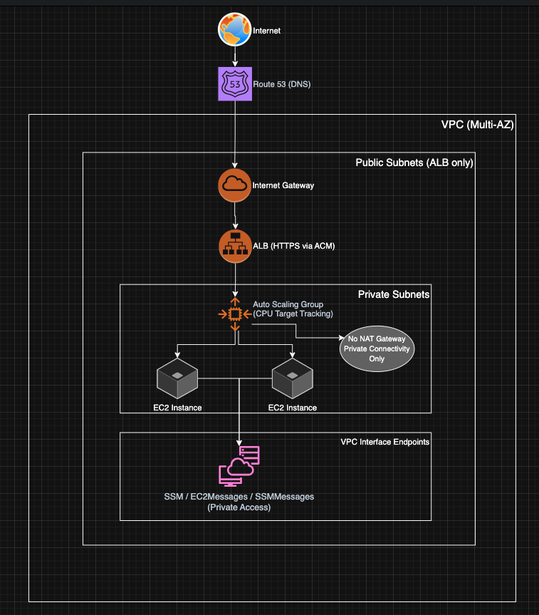
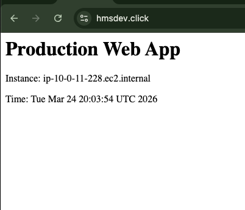
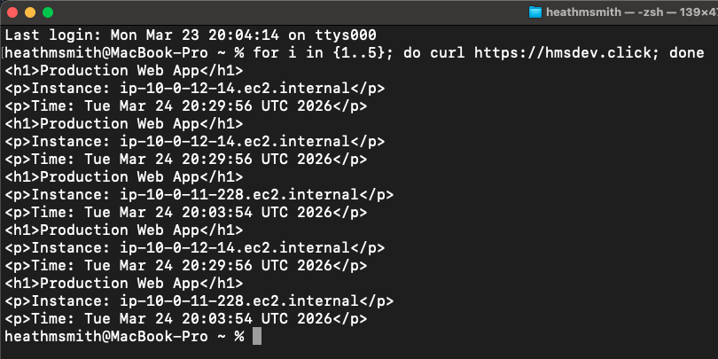

# Production Web Application on AWS (Terraform)

## Overview

This project provisions a production-style web application environment in AWS using Terraform. The goal was to build something that reflects how real systems are designed—secure by default, scalable, and cost-conscious.

Instead of just getting something working, I focused on making intentional design decisions and validating them along the way (load balancing, scaling, and private connectivity).

---

## Architecture

This setup includes:

- A custom VPC across two availability zones
- Public subnets for the Application Load Balancer (ALB)
- Private subnets for EC2 instances (no public IPs)
- Auto Scaling Group (ASG) for resilience and scaling
- HTTPS via AWS Certificate Manager (ACM)
- Route53 for DNS
- AWS Systems Manager (SSM) for instance access
- VPC Interface Endpoints for private AWS service connectivity

---

## Architecture Diagram




## Key Design Decisions

### Private Compute (No Public Access)

All EC2 instances run in private subnets with no public IPs. There is no SSH access. Instead, I used AWS Systems Manager (SSM) for secure, auditable access.

### No NAT Gateway

I initially considered using a NAT Gateway for outbound access, but chose not to in order to reduce cost and simplify the design. Instead, I implemented VPC interface endpoints for SSM so instances can communicate with AWS services privately.

### Security Group Design

- The ALB allows inbound HTTP/HTTPS from the internet
- EC2 instances only allow inbound traffic from the ALB (not from the internet)
- This enforces a clear separation between public and private layers

### HTTPS Everywhere

TLS certificates are provisioned using ACM and validated via Route53. HTTP traffic is redirected to HTTPS at the load balancer.

---

## Scalability

The application is backed by an Auto Scaling Group using a target tracking policy based on CPU utilization.

To validate this, I:
- Generated artificial CPU load on an instance by running command: "yes > /dev/null" & for scale out event
- Observed CloudWatch metrics
- Confirmed that a new instance launched automatically
- Verified that traffic was distributed across instances
- Once the scale out event was validated, I ran the command killall yes to test scaling in

---

## Load Balancing Validation

To confirm the ALB was distributing traffic correctly, I sent multiple requests and verified responses came from different instances (based on hostname output).

---

## Private Connectivity (SSM)

SSM access is enabled using VPC interface endpoints:

- com.amazonaws.us-east-1.ssm
- com.amazonaws.us-east-1.ec2messages
- com.amazonaws.us-east-1.ssmmessages

Private DNS is enabled so instances can resolve AWS service endpoints internally without needing internet access.

---

## Cost Considerations

- No NAT Gateway (avoids unnecessary monthly cost)
- Minimal always-on infrastructure
- Uses managed services where appropriate

---

## Deployment

From the `examples/production-webapp` directory:

```bash
terraform init
terraform plan
terraform apply
```

---

## Inputs

Example `terraform.tfvars`:

```hcl
ami_id      = "ami-xxxxxxxx"
domain_name = "example.com"
zone_id     = "ZXXXXXXXXXXXX"
```

---

## Outputs

- ALB DNS name (entry point to the application)

## Demo

### Application Output

The application returns dynamic instance metadata, confirming that requests are being served by live EC2 instances:



---

### Load Balancing Verification

Multiple requests were issued to confirm that traffic is distributed across instances:



---

## Project Structure

```
modules/
  vpc/
  alb/
  asg/
  acm/

examples/
  production-webapp/
```

---

## What This Project Demonstrates

- Infrastructure as Code using Terraform
- Secure AWS networking patterns
- Load balancing and auto scaling
- Private service connectivity without NAT
- Real-world debugging and validation

---

## Possible Improvements

If I were to extend this further:

- Add CloudWatch alarms and dashboards
- Introduce CI/CD (GitHub Actions)
- Add centralized logging (S3 / CloudWatch Logs)
- Expand to multiple environments (dev/stage/prod)

---

## Summary

This project was built to reflect how I would approach a real-world AWS deployment—prioritizing security, simplicity, and cost efficiency while still validating that everything works under load.


## Challenges & Lessons Learned

One of the main challenges was enabling SSM access in a fully private VPC without using a NAT Gateway.

Initially, instances were not appearing in Fleet Manager because they could not reach the public SSM endpoints. This was resolved by:

- Creating VPC interface endpoints for SSM, EC2Messages, and SSMMessages
- Enabling private DNS on each endpoint
- Adjusting security group rules to allow HTTPS traffic from the EC2 instances to the endpoints

Another issue encountered was a 502 error from the ALB, which was traced back to the application not being available on the instances due to lack of internet access. This was resolved by modifying the user_data script to run a lightweight Python web server instead of installing Apache.

These issues reinforced the importance of understanding AWS networking, DNS behavior, and dependency management in private environments.
